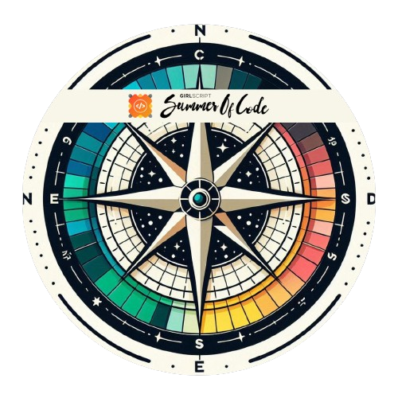

<h1>Hey there,Select Jashwanth From Tech! </h1>

 

### 💫 About Me

- 🎓 I'm a Student pursuing CSE (AI & ML) at Ramaiah Institute of Technology  
- 🔭 I’m currently working on **Next.js** and **Web Development**  
- 🌱 I’m currently learning **DevOps**  
- 👯 I’m looking to collaborate with open source enthusiasts  
- 🥅 2024 Goals: Strengthen DevOps, improve DSA, and expand my portfolio  

 

## 🌐 Socials:

 

## 💻 Tech Stack:

 

## 📊 GitHub Stats:

 

# 🏆 Trophies

# 🎖 Badges

### GSSoC'24 Badges

  
  
  
  
  
  
  
  

 

  
<b> HoloPin Badges </b>

  

 

  <b>Thanks for visiting my profile! If you appreciate my work, consider buying me a coffee. 😊</b>

  

